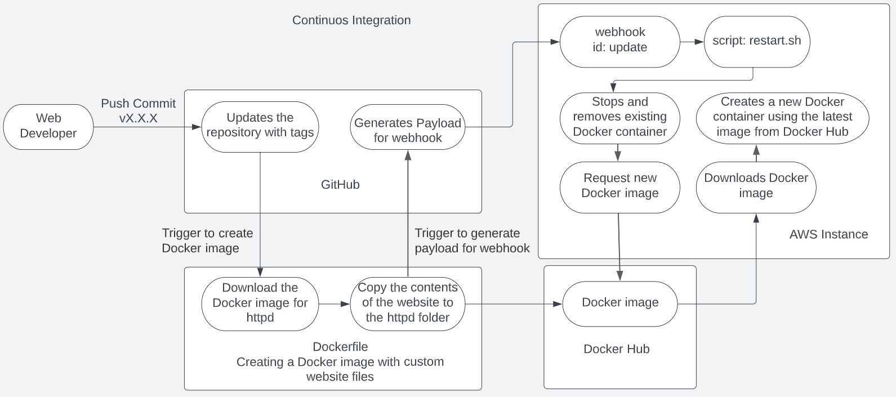

# CD Project Overview
- The first part of this project involves the process of adding semantic versioning to project 4. The second part of this project adds automatization by using webhooks and a script that can stop and removing an existing container before it is replaced by a new container using the latest Docker image from Docker Hub.
-

- This project requires the following tools 
  - Ubuntu Server 22.XX in AWS
  - GitHub
  - Docker
  - Docker Hub
  - Adnanh's webhook.
  - The Dockerfile from project 4

## Part 1 - Semantic Versioning
- This workflow will be activated when a change is pushed to GitHub with the tag 'vX.X.X'. This will update the GitHub repository and it will also create a new Docker image with the tag 'v.X.X.X' and also the Docker image with the tag 'latest'.
- To enable Docker Hub to receive and create images using the same tag 'vX.X.X' from the push to GitHub, the following changes are necessary.
  - Add the following to the 'on' section to activate the workflow when a tag starting with 'v*' is detected:
  '''
  on:
  workflow_dispatch:
  push:
  branches:
  - "master"
  tags:
  'v*'
  '''
  - On the section for 'jobs/build/steps' add the following so that Docker Hub can receive the version number for the new image
  '''
  name: Docker meta
  id: meta
  uses: docker/metadata-action@v4
  with:
    images: |
      ${{ secrets.DOCKERHUB_USERNAME }}/"the name of the repository"
    tags: |
      type=semver,pattern={{version}}
  '''
  - Finally, the ‘build and push’ section will provide Docker Hub with the Dockerfile and the tag information necessary for the creation of the name of the image with the format 'vX.X.X':
  '''
  name: Build and push
  uses: docker/build-push-action@v4
  with:
    context: .
    file: ./Dockerfile
    push: ${{ github.event_name != 'push tag' }}
    tags: ${{ steps.meta.outputs.tags }}
    labels: ${{ steps.meta.outputs.labels }}
  '''

- How to generate a tag in git / GitHub
  - To generate a tag in GitHub, run the following command to commit the changes:
  '''
  git commit -a -m "name for update"
  '''

- The next step is to find the next available version number with:
'''
git tag
'''
- After reviewing the list of version numbers, search assign the next version number depending of the type of release. To create the next version number, type:
'''
git tag -a vX.X.X -m "name for update"
'''
- To push the new version to Git Hub, type:
'''
git push origin vX.X.X
'''
- If everything has worked properly, the new Docker image will be posted in [Docker Hub](https://hub.docker.com/r/juanapolinar001/my-website3/tags).

## Part 2 – Continuous Deployment
- The first step is to install Docker Hub in the AWS instance.
  - To install Docker in the AWS instance, first update and upgrade the Ubuntu repositories:
  '''
  sudo apt-get update && sudo apt-get upgrade -y
  '''
  - Next, type the command to install Docker:
  '''
  sudo apt install docker
  '''
  - To check if Docker is running, type:
  '''
  sudo systemctl status docker
  '''
  - To start and enable Docker, type:
  '''
  sudo systemctl start docker && sudo systemctl enable docker
  '''
- To enable Docker to connect to Docker Hub and to download Docker images, a script must be written with the necessary commands to stop a running container, download a new image, and run a new container using that image.
  - In the 'ubuntu' user home directory on the AWS instance, create a new file with the name 'restart.sh' using:
  '''
  touch restart.sh
  '''
  - Open 'restart.sh' and type the following:
    - To make the file a bash an executable:
    '''
    #! /bin/bash
    '''
    - To stop the current running container with the name 'site':
    '''
    sudo docker stop site
    '''
    - To remove delete the existing container with the name 'site':
    '''
    sudo docker rm site
    '''
    - To download the new image from Docker Hub:
    '''
    sudo docker pull juanapolinar001/my-website3:latest
    '''

    - To start a new container using the new image:
    '''
    sudo docker run -d -p 80:80 --name site juanapolinar001/my-website3:latest
    '''
    - The file should look like:
    '''
    #! /bin/bash
    sudo docker stop site
    sudo docker rm site
    sudo docker pull juanapolinar001/my-website3:latest
    sudo docker run -d -p 80:80 --name site juanapolinar001/my-website3:latest
    '''
    - To add executable rights:
    '''
    chmod u+x restart.sh
    '''
- Setting up a 'webhook' on the AWS instance
  - To install ‘adnanh’ webhook, run:
  '''
  sudo apt-get install webhook
  '''
- Setup of the webhook configuration file
  - Create a file using
  '''
  sudo vim /etc/webhook.conf
  '''
  - On the file 'webhook.conf', type id as the name of the webhook that will trigger this task. In this case, the name is 'update'
  '''
  "id": "update",
  '''
  - On the next line, type the name of the file to be executed as './restart.sh'
  '''
  "execute-command": "./restart.sh",
  '''
  - On the next line, type the working directory of the file to be executed as '/home/ubuntu'
  '''
  "command-working-directory": "/home/ubuntu",
  '''
  - On the finale line, add the response from the server to GitHub as 'Redeploying web server.'
  '''
  "response-message": "Redeploying web server."
  '''
  - The file 'webhook.conf' should look as follows:
  '''
   [
    {
      "id": "update",
      "execute-command": "./restart.sh",
      "command-working-directory": "/home/ubuntu",
      "response-message": "Redeploying web server."
    }
  ]
  '''
  - Setup webhook in the AWS instance
    - Restart webhook with
    '''
    sudo systemctl restart webhook.service\
    '''
    - ensure that webhook is running by running
    '''
    sudo systemctl status webhook.service
    '''
    - To enable the webhook to listen in port 9000, type
    '''
    webhook -hooks /etc/webhook.conf -verbose
    '''
  - Setup of webhook in the AWS security group
    - Click the 'Security' tab for the AWS instance and then click on 'security groups'
    - Click 'Edit Inbound Rules'
    - Click Add rule
    - On the Type column, select 'Custom TCP'
    - On the Port Range column, type '9000'
    - On the source dropdown menu, select 'Anywhere-IPv4'
    - On the Description, type 'webhooks'
    - Click 'Save rules'
  - Setup webhooks on GitHub
    - On the repository main screen, click 'Settings'
    - On the left pane, click 'webhooks'
    - On the field for 'Payload URL', type:
    '''
    http://<aws ip>:9000/hooks/update
    '''
    - On the dropdown for Content type, select 'application/json'
    - On the 'Which events would liike you like to trigger this webhook?' de-select 'pushes' and select 'Workflow runs'
    - Click 'Add webhook'
