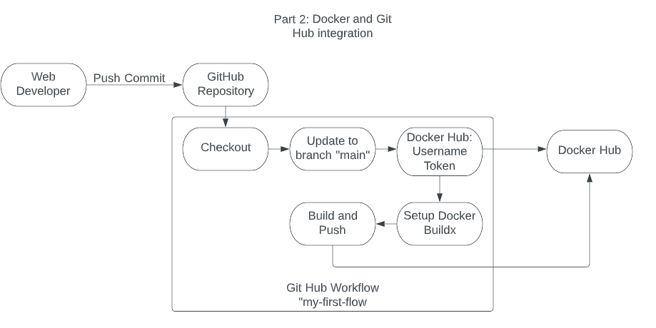

# Part 1 - Semantic Versioning

## CD Project Overview
- The first part of the of this project is to add semantic versioning to project 4 and to generate stuff

 a deployable docker image with an imbedded website using the Apache httpd docker image. Creating docker images for websites, and other applications, simplifies the deployment of these applications across multiple hosts in a network. 
  - 

- The second part of this project, will guide you on how to create a free public repo in Docker Hub and to create Docker container using Git Hub for version control.
  - 
- This project requires the following tools:  
  - WSL2
  - Docker Desktop
  - GitHub Desktop
  - Docker Hub free account

- If performing this lab in a local Windows Machine, follow these steps:
  - Open the Microsoft Store and search for WSL2 and click Install on Ubuntu 22.04.2 LTS. wait until WSL2 is fully installed before continuing to the following step.
  - After installing WSL2, browse to the [Docker website](https://docs.docker.com/desktop/install/windows-install/) and install Docker by clicking on `Desktop for Windows`. reboot the system when the installation is complete.
  - Proceed to install GitHub Desktop and link it to the repo for this project