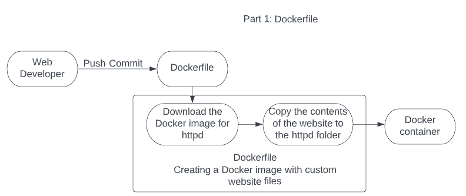

# Part 1 - Semantic Versioning

## CD Project Overview
- The first part of this project is to add semantic versioning to project 4 plus the automatization of using webhooks and a script that could pull a new image from Dockerhub. the tools to be used are Ubuntu in AWS, GitHub, Docker Hub and adnanh's webhook.

- This workflow will be activated when a cahnge is pushed to GitHub with the tag 'vX.X.X'. this will update gitHub and also create a new Docker image with the version 'v.X.X.X' and it will also update the image with the tag 'latest'.

- To enable Docker Hub to receive and create images using the same version 'vX.X.X' from the push to GitHub, the following changes are necessary.

	- Add the following to the 'on' section to activate the workflow when a tag starting with 'v*' is detected:
	'''
	on:
  	  workflow_dispatch:
  	  push:
    	    branches:
      	      - "master"
            tags:
              'v*'
	''' 

	- On the section for 'jobs/build/steps' add the following so that Docker Hub can receive the version number for the new image:
	'''
        name: Docker meta
        id: meta
        uses: docker/metadata-action@v4
        with:
          images: |
            ${{ secrets.DOCKERHUB_USERNAME }}/"the name of the repository"
          tags: |
            type=semver,pattern={{version}}
	'''

	- Finally, the build and push section will provide Docker Hub with the Dockerfile and the tag information necessary for the creation of the name of the image with the format 'vX.X.X':
	'''
	name: Build and push
        uses: docker/build-push-action@v4
        with:
          context: .
          file: ./Dockerfile
          push: ${{ github.event_name != 'push tag' }}
          tags: ${{ steps.meta.outputs.tags }}
          labels: ${{ steps.meta.outputs.labels }}
	'''

- How to generate a tag in git / GitHub
	- To generate a tag in GitHub, run the following command to commit the changes:
	'''
	git commit -a -m "name for update"
	''' 

	- The next step is to look into the next available version number with:
        '''
        git tag
        '''
	
	- After reviewing the list of version number, serach assign the next version number depending of the type of release. To create the nex version, type the following:
        '''
        git tag -a vX.X.X -m "name for update"
        '''

	- to push the new version to Git Hub, type: 
        '''
        git push origin vX.X.X
        '''

- If everything worked properlly, the new Docker image will be posted in [Docker Hub](https://hub.docker.com/r/juanapolinar001/my-website3/tags). 

 a deployable docker image with an imbedded website using the Apache httpd docker image. Creating docker images for websites, and other applications, simplifies the deployment of these applications across multiple hosts in a network. 
  - 

- The second part of this project, will guide you on how to create a free public repo in Docker Hub and to create Docker container using Git Hub for version control.
  - 
- This project requires the following tools:  
  - WSL2
  - Docker Desktop
  - GitHub Desktop
  - Docker Hub free account

- If performing this lab in a local Windows Machine, follow these steps:
  - Open the Microsoft Store and search for WSL2 and click Install on Ubuntu 22.04.2 LTS. wait until WSL2 is fully installed before continuing to the following step.
  - After installing WSL2, browse to the [Docker website](https://docs.docker.com/desktop/install/windows-install/) and install Docker by clicking on `Desktop for Windows`. reboot the system when the installation is complete.
  - Proceed to install GitHub Desktop and link it to the repo for this project
