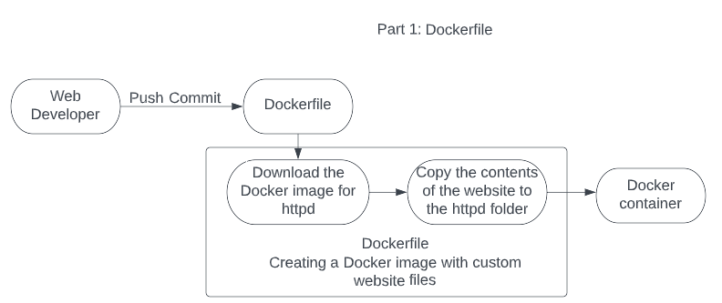
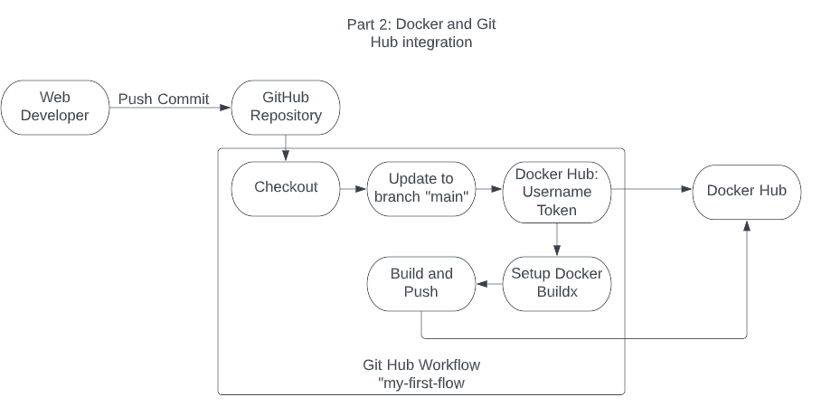

# Part 1 - Dockerize it

## CI Project Overview
The first part of the purpose of this project is to create a deployable docker image with an imbedded website using the Apache httpd docker image. Creating docker images for websites, and other applications, simplifies the deployment of these applications across multiple hosts in a network. 


The second part of this project, will guide you on how to create a free public repo in Docker Hub and to create Docker container using Git Hub for version control.

This project requires the following tools:  
 - WSL2
 - Docker Desktop
 - GitHub Desktop
 - Docker Hub free account

If performing this lab in a local Windows Machine, follow these steps:
 - Open the Microsoft Store and search for WSL2 and click Install on Ubuntu 22.04.2 LTS. wait until WSL2 is fully installed before continuing to the following step.
 - After installing WSL2, browse to the [Docker website](https://docs.docker.com/desktop/install/windows-install/) and install Docker by clicking on `Desktop for Windows`. reboot the system when the installation is complete.
 - Proceed to install GitHub Desktop and link it to the repo for this project

To build an image from the `Dockerfile`: 
 - Create the Dockerfile in the same folder for the GitHub repo.
 - Add the following to the Dockerfile:
    ```  
    FROM httpd:2.4

    COPY ./website/ /usr/local/apache2/htdocs/
    ```
 - Save the Dockerfile
 - To create the docker image that is named `website` and that it also uses the Dockerfile, run the following command:
    ```  
    docker build -t my-apache2 .
    ```
 - To ensure that the image has been created, type the following:
    ```  
    docker images
    ```
 - The image with the name `website` should appear
 - To create a container named `my-website` and with the image `website`, type the following:
    ```   
    docker run -d --name my-website -p 80:80 website
    ```
 - To see if the image has been successfully created and running, type the following command:
    ```   
    docker ps
    ```
 - To test the website, open a web browser and type:
    ```
    127.0.0.1:80
    ```

# Part 2 - GitHub Actions and Docker Hub
- Follow these steps to create public repo in Docker Hub:
  - Navigate to [Docker](https://hub.docker.com/signup)and enter your account information. click Sign Up
  - On the page for `Choose a Plan`, click on `Continue with Free`
- To authenticate with Docker Hub via CLI using Docker hub a token:

  - On a web browser, navigate to (Docker's security section)[https://hub.docker.com/settings/security] and click `New Access Token`
  - provide a description to the token and select the `Read, Write, Delete` option. Click Generate
  - copy the token and store it in a safe place
  - on WSL2, type:
    ```
    docker login -u <your username>
    ```
  - At the password prompt, paste the token and then press enter

- To push a container to Docker Hub:
  - First commit the changes with the following command
    ```
    docker commit -m "website" -a "Juan Apolinar" my-website3 ${{ secrets.DOCKERHUB_USERNAME }}/my-website3:latest
    ```
  - Next, logon to docker using:
    ```
    docker login
    ```
  - After logon, use the following command to push the container to docker
    ```
    sudo docker push juanapolinar001/my-website3
    ```
  - Here is the link to the (container)[https://hub.docker.com/r/juanapolinar001/my-website3]

- Configuring GitHub Secrets
  - To configure GitHub secrets, navigate to the repo and click (Settings)[https://github.com/WSU-kduncan/3120-cicd-japolinarmejia/settings]
  - On the left pane, click `Secrets and variables` and then click `actions`
  - To add the docker username, click `New repository secret`
  - On the name textbox, type `DOCKERHUB_USERNAME`
  - On the Secret textbox, type `${{ secrets.DOCKERHUB_USERNAME }}`
  - Click `Add secret`
  - To add the docker token, click `New repository secret`
  - On the name textbox, type `DOCKERHUB_TOKEN`
  - On the Secret textbox, type `${{ secrets.DOCKERHUB_TOKEN }}`
  - Click `Add secret`
 
- Behavior of GitHub workflow
  - The workflow creates a Docker container in Docker Hub. This action takes place every time there is a git commit and git push. The workflow will use the `Dockerfile` in the repo and that Dockerfile will use the website files in the website folder. 

  - Here is the list of variables that could be customized to meet any needs:
    - name: add your own name for the variable
    - branches: if using multiple branches, type the name of the branch that will be linked to this workflow
    - runs-on: Select the Operating System that is required for the container 
    - jobs: steps: with: tags: ${{ secrets.DOCKERHUB_USERNAME }}/: Select the name of the docker container and the version number that will be assigned to the new container
  
# Part 3 - GitHub Actions and Docker Hub

Include a diagram (or diagrams) of the continuous integration process.  A good diagram will label tools used and how things connect.  This diagram would probably look best near your project description.

